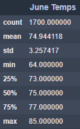
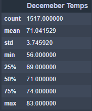

# Surfs Up

## Challenge Overview
You are to determine if the surf and ice cream shop business is sustainable year-round by gathering information about temperature trends for the months of June and December.

## Resources
- Data Source: hawaii.sqlite
- Software: Jupyter Notebook 6.0.3, Python 3.7.7, Visual Studio Code 1.47.2

## Challenge Results
Temperature Statistics for June | Temperature Statistics for December
:------------------------------:|:-----------------------------------:
 | 

- The average temperatures of both June and December are relatively the same.
- The minimum temperature for December is 56, much lower than the minimum of June.
- The maximum temperature for June is 85, which is close to the maximum of December.

## Challenge Summary
Comparing the temperature statistics for both June and December, we can see that average temperatures are close together, 74 and 71 respectively. This shows that both months are well suited for surf and ice cream weather. Even though the minimum temperature for December can drop down to 56, the month as a whole is still fitting for surf and ice cream.

One additional query I would perform is to see what the precipitation is like during June and December. This could show us the type of weather that happens during these two months. Another query would be the statistics of the precipitation during June and December. This would tell us the likelihood of occurence of precipitation.
